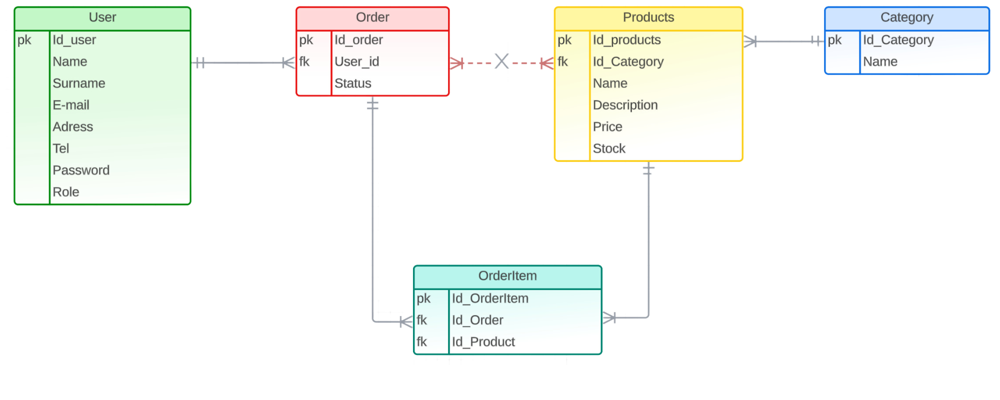
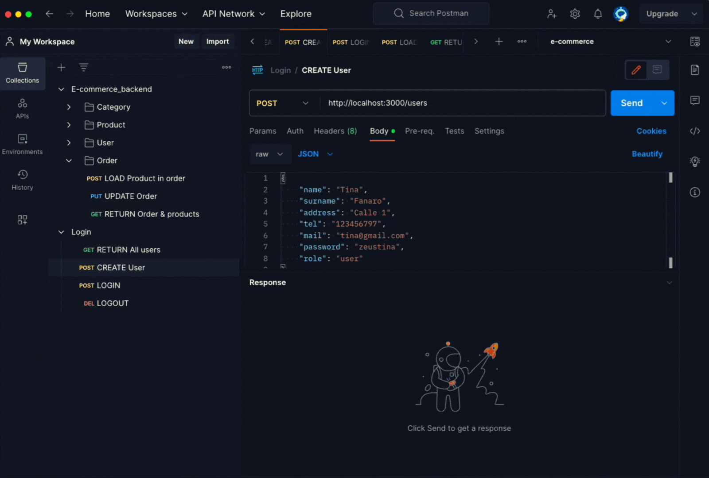

# **<h3 align="center">Backend Project 💻</h3>**

---

## **<h4 align="center">REST API development for e-commerce 🛒</h4>**

---

**<h4 style="color: fuchsia;">Included CRUD functionalities:</h4>**

1. Product category management.
2. Product inventory management.
3. User management (login, logout, registration, roles).
4. Order management.

**<h4 style="color: fuchsia;">Backend architecture:</h4>**

-   Product category management: Allows the creation, update, and deletion of product categories.
-   Product inventory management: Enables the administration of product inventory, including the creation, update, and deletion of products.
-   User management: Provides functions for user registration, login and logout, permission management, and user roles.
-   Order management: Allows the creation and management of customer orders.

**<h4 style="color: fuchsia;">Technologies used in the backend architecture:</h4>**


-   **Database:** <span style="color: #00BFFF;">**MySQL**</span> has been used as the database to store information related to categories, products, users, and orders.
-   **ORM Framework:** <span style="color: #00BFFF;">**Sequelize**</span> is used as an Object-Relational Mapping (ORM) tool to facilitate interaction with the MySQL database.
-   **Backend technology:** <span style="color: #00BFFF;">**Node.js**</span> has been used to develop the backend application, leveraging its ability to handle requests and responses asynchronously.
-   **Web server:** <span style="color: #00BFFF;">**Express**</span> is utilized as a web server framework for Node.js, enabling request routing and implementation of API endpoints.

-   Relevant tests for all API endpoints have been conducted using the <span style="color: #00BFFF;">**Postman**</span> application.

-   Use of <span style="color: #00BFFF;">**Bcrypt:**</span> Regarding security aspects, user passwords are encrypted using the hashing technique, which consists of concatenating the password with a randomly generated string called "salt".

-   Furthermore, the user login generates a token on the server following the <span style="color: #00BFFF;">**JSON Web Token (JWT)**</span> scheme. This token is then used to validate calls to non-public endpoints.

-   General development with <span style="color: #00BFFF;">**Javascript**</span>: Allows for efficient handling of asynchronous requests and seamless API integration.

## **Project Development** 🔧

The project was completed within a ten-day timeframe as part of an exercise for **The Bridge Valencia's FullStack Bootcamp**.

It consists of the development of a REST API for an e-commerce, for which a database with user entities, order, categories and products has been created. With a relationship of (M:N), where an associative entity of orderItem was created, in addition to the relationships (1 : N) between the other entities.

---

<span style="color: fuchsia;">**Entity Relationship Diagram:**</span>



---

## **Process steps** 🔩🔧⚙️

1. Dependency installations

2. Configuration and database creation

3. Creation of models for each table

4. Model migrations

5. Creation of controllers for endpoints

6. Routes creation

7. Imports

8. Testing with Postman

9. Development of functionality tests and validation

---

### **Postman preview:**

-   Create user
-   Login
-   Create an order with products
-   Logout



---

## Future work

**Functional requirements:**

-   Sending an account activation email.
-   Order confirmation through OTP (One Time Password).
-   Allowing users to write product reviews.

**Non-functional requirements:**

-   Adding more API tests.
-   Configuring Jest and Supertest to run tests using an in-memory database (such as SQLite).

---

# Useful commands

## Docker

Docker installation on Ubuntu:

```bash
sudo apt-get install docker-ce docker-ce-cli containerd.io docker-buildx-plugin docker-compose-plugin
```

Creation of a custom builder:

```bash
docker buildx create --name mybuilder
```

Set the custom builder for use:

```bash
docker buildx use mybuilder
```

Install specific building plugin for ARM architectures ([source](https://hub.docker.com/r/tonistiigi/binfmt)):

```bash
sudo docker run --privileged --rm tonistiigi/binfmt --install arm64
```

Check if the plugin has been installed:

```bash
docker buildx inspect --bootstrap
```

Build and push the Docker image ready for ARM and AMD platforms (Docker account required and already logged in):

```bash
docker buildx build --push --tag dfanaro/e-commerce_backend:latest --platform linux/arm64,linux/amd64 .
```

Pull the Docker image recently pushed:

```bash
docker pull dfanaro/e-commerce_backend:latest
```

Run the Docker image recently pulled:

```bash
docker run -p 9001:9001 -d --name=e-commerce-api --restart=always -v e-commerce_backend:/usr/src/app/uploads dfanaro/e-commerce_backend:latest
```

## Sequelize

Create a new migration:

```bash
npx sequelize-cli migration:generate --name modify_users_add_avatar_column
```

Migrate changes to the database:

```bash
npx sequelize-cli db:migrate
```

Roll back changes made to the database:

```bash
npx sequelize-cli db:migrate:undo --name 20230822151147-modify_users_add_avatar_column.js
```

#### Developed by _Patrizia González Garcia_.
