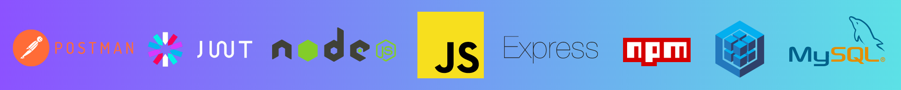

# 💻  E-commerce Backend Project 

## REST API development for e-commerce

**The included functionalities are as follows:**

1. Product category management.
2. Product inventory management.
3. User management (login, logout, registration, roles).
4. Order management.

**The backend architecture functionalities:**

- Product category management: Allows the creation, update, and deletion of product categories.
- Product inventory management: Enables the administration of product inventory, including the creation, update, and deletion of products.
- User management: Provides functions for user registration, login and logout, permission management, and user roles.
- Order management: Allows the creation and management of customer orders.

****Technologies used in the backend architecture:****

- **Database:** **MySQL** has been used as the database to store information related to categories, products, users, and orders.
- **ORM Framework:** **Sequelize** is used as an Object-Relational Mapping (ORM) tool to facilitate interaction with the MySQL database.
- **Backend technology:** **Node.js** has been used to develop the backend application, leveraging its ability to handle requests and responses asynchronously.
- **Web server:** **Express** is utilized as a web server framework for Node.js, enabling request routing and implementation of API endpoints.

- Relevant tests for all API endpoints have been conducted using the **Postman** application.

- Use of **Bcrypt:** Regarding security aspects, user passwords are encrypted using the hashing technique, which consists of concatenating the password with a randomly generated string called "salt".

- Furthermore, the user login generates a token on the server following the **JSON Web Token (JWT)** scheme. This token is then used to validate calls to non-public endpoints.

- General development with **Javascript**: Allows for efficient handling of asynchronous requests and seamless API integration.

**Postman**

## Project Development 🔧

The project was completed within a seven-day timeframe as part of an exercise for **The Bridge Valencia's FullStack Bootcamp**.

It consists of three core files: index.html, main.js, and style.css.
The game logic was developed first, and then followed by the definition of styles.

The necessary functions were implemented to execute the code as efficiently as possible.

## Technologies Used 💻

Up to this point in the course, the technologies learned and used were the following:

-   HTML.
-   CSS.
-   JavaScript (including SPA and API usage with Axios).
-   Bootstrap Framework.

Preview:

## Future work

1. Allow the user to select the question's theme, difficulty and number of questions to be answered.
2. Play sounds when players gets correct/incorrect answers.
3. Show a graph with the best players according to their scores.
4. Show a picture on every question for visual hint.

#### Developed by _Patricia González Garcia_.
